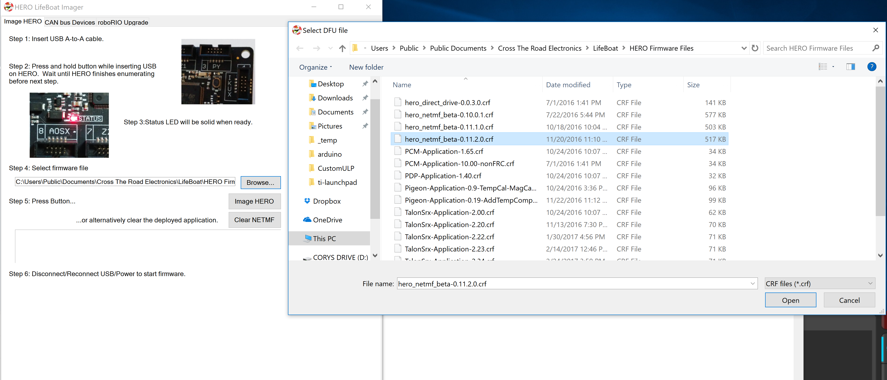
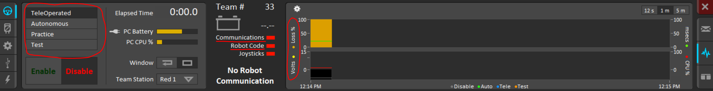

# What is the Driver Station?
The driver station is a program created by FIRST that allows teams to control their robot wirelessly through a 2.4ghz Wifi radio.
Normally, the driver station is allowed only to work with the RoboRIO and its own Driver station class, which handles the UDP frames by itself.
The software in this repo is what is needed to make an [ESP12F module](http://www.ctr-electronics.com/gadgeteer-wifi-module.html#product_tabs_technical_resources) along with a [HERO development board](http://www.ctr-electronics.com/hro.html) to talk with the Driver station and provide enough functionality to get a robot to drive using the driver station.
# Quick Start Guide
1. Ensure HERO is imaged with latest firmware, see below for instructions on flashing the latest firmware
2. Connect ESP Module to port 1 of HERO
3. Deploy HERO_ESP_Writer project to HERO
4. Keep an eye on the logs to ensure the file is written
5. Once the Module is flashed, connect to its WiFi. The password is "password1"
6. Set computer to static IP (Process below)
7. Deploy HERO_DriverStationExample to HERO
8. Open FRC Driver station
9. Put in team 33
10. You're good to go

This is what a successful module flash looks like


## Setting Computer to static IP
1. Right click on wireless connections, the button you pressed to connect to the module
2. Click on Network and Sharing Center
3. Click on the network in the middle right next to Connections
4. Click on Properties
5. Click on Internet Protocol Version 4 (TCP/IPv4) and click Properties
6. Check Use the following IP address
  * IP address: 10.0.33.5
  * Subnet mask: 255.0.0.0
  * Default gateway: Blank
7. Click OK and exit out of everything
## Flashing the HERO
1. Connect HERO to computer using A to A USB cable
2. While connecting HERO to computer, hold down button putting it into bootloader mode
3. Open Lifeboat imager
4. Select correct firmware, at the time of this writing it was 0.11.2.0.crf
5. Press Image HERO



# Functional Features of Driver Station
* Selecting mode robot is in, ie Teleop Enabled, Auton disabled, Test disabled
* Enable/Disable safety, Watchdog is automatically fed if enabled, otherwise it isn't
* Communications and Robot code indicators work as expected
* Multiple joysticks
* Round trip time graph on Driver Station
* Battery voltage can be sent to driver station



# What is in here?
* Bin File - The .bin file for driver station functionality
* BinSplitter - The project that takes a bin file and splits it into 11 25kb files that the HERO can use
* Documentation - Folder for pictures and files that show how this was created
* ESP_DriverStation_Source - Arduino source code for ESP module that enables driver station
* HERO_DriverStationExample - Example project for enabling the driver station and controlling a robot using Arcade drive
* HERO_ESP_Writer - Project that flashes the bin files to the ESP module
# What is needed for functionality?
All the hardware needed for this functionality is the HERO board and an ESP12F module along with a ribbon cable connecting the two.
You are able to flash the module without a HERO, however it is much more complicated and requires a gadgeteer breakout, a 3.3v source, and a usb to ttl cable. Once you flash the module once it is possible to perform an Over the Air (OTA) update.
Software wise, a new firmware image needs to be flashed onto the ESP module, but the ability to do so is done through the HERO itself, and an example project is set up to work with the new driverstation class.
### Process for flashing the Module with HERO
Look at Quick Start Guide above
### Process for flashing the module OTA
Connect to the module over wifi and find its IP. Put the IP into a web browser of your choice, and append /update onto the address. You will be presented with two buttons, click the left one, choose the bin file, and click update. The bin file will be uploaded to the module and flashed by itself
# How to use the Driver Station
An example project is included that shows how to use the driver station class. The basic steps are:

*Define the Driver Station object, specify a port*
```c#
  CTRE.FRC.DriverStation ds = new CTRE.FRC.DriverStation(new new CTRE.HERO.Port1Definition());
```
*Define a controller using the Driver Station object as your provider*
```c#
  CTRE.Controller.GameController _gamepad = new CTRE.Controller.GameController(ds, 0);
```
*Call ds.update in your main loop*
```c#
  ds.update();
```
*Treat the controller as a normal controller*
```c#
  var y = _gamepad.getAxis(1);
```
# Key notes in the Firmware
The Module firmware currently hard codes the SSID and Password into the module. If you would like to change that, or do anything else with the firmware, you are free to. For SSID and Password it is inside the setup function under the function WiFi.softAP, use the search function to find it. In order to flash the module with the new firmware, follow these next few steps.
1. Run the Binary Splitter project, and point to the bin file from the arduino compile
2. Find the 11 bin files the project will spit out.
3. Open the wifi esp flasher project
4. Right click on the project under project view, and go into properties
5. Go under the resources tab, in the upper left there is a drop down, make sure it's set to files
6. Delete all the files inside the viewer
7. Copy and paste the 11 bin files you found earlier into the viewer, click ok to every prompt
8. Save the properties and run the program as if you were flashing the wifi module normally.
9. You're good to go
# How this works
The Driver station's protocol for sending data is largely hidden behind the scenes. Using a program called [Wireshark](https://www.wireshark.org/) I was able to find the individual datagrams and figure out what each byte meant, along with the ports the Driver station expects to use for transmitting and receiving data.

Further documentation on this topic is inside the documentation folder, including a wireshark capture of the roborio-dashboard discussion over USB.
## Datagram breakdown
* Driver Station to Robot (Port 57655 -> Port 1110)
  * 1,2 Packet # - These two bytes, big endian, specify what number packet this is, and is used for latency control on the Driver Station
  * 3 Unknown currently
  * 4 Robot State - Specifies what state the robot is in, 0-2 is Teleop, Test, Auton disabled respectively, 4-6 is the enabled version
  * 5,6 Unknown currently
  * 7- Joystick data, length varies on type of joystick and how many are plugged in. For detailed information look at Driverstation Class
* Joystick Data
  * 1 - Number of bytes for joystick
  * 2,3 - Unknown currently (I think it's joystick model)
  * 4 - X number of joysticks
  * 5-(X+4) - Joystick axis data (signed byte) (each byte is an axis)
  * (X+5) - number of buttons
  * (X+6),(X+7) - bitmap of buttons
  * (X+8) - Number of POV's/Hats
  * (X+9),(x+10) - POV direction (unsigned byte)
* Robot to Driver Station (Port 34959 -> Port 1150)
  * 1-4 Same first four bytes from Driver station, ensures packets were sent correctly
  * 5-7 Battery voltage, first byte is integer voltage, second and third is decimal voltage
  * 8- Unknown currently
  
Below is a picture of a capture from Wireshark with the UDP packet from the computer to the RoboRIO, only one joystick connected.


## Firmware Flashing
The ESP's protocol to flashing an image into its flash is controlled through a ROM bootloader. This bootloader expects certain packets to come in, with details on the packet in the packet header. The overall process for flashing an image is
1. Put ESP into bootloader mode by pulling GPIO0 down (Pin 3 on the HERO Gadgeteer port) and resetting the module by pulling RESET down (Pin 6 on the HERO)
2. Sync baud rate of ESP to baud rate on flasher - this is done using a special packet that sends AA to the module multiple times
3. Erase flash on module - Another packet is sent that specifies the amount of space needed for the flash
4. Send .bin contents - Multiple packets are sent with the .bin contents inside them
5. Close the bootloader - A single packet is sent with the end command to take the module out of bootloader mode.
### Firmware protococol
For those wanting to create their own flashing tool, this may prove helpful
#### Packet header protocol
Largely based off [this](http://domoticx.com/esp8266-esptool-bootloader-communicatie/) sheet, it details exactly what is needed in the packet header and how to go about flashing the firmmware.

Key notes: 
* The module uses [SLIP](https://en.wikipedia.org/wiki/Serial_Line_Internet_Protocol) protocol, which means except for the header and footer, there are no 0xC0's in the packets, and so they must be replaced if they are needed.
* Checksum is created by doing XOR operation on all data bytes before the SLIP framing is done, and then that must be framed in case it is a 0xC0 or 0xDB
* Length of data is calculated before the SLIP framing
* You must make sure the other end is done talking before you can talk yourself
* Currently the amount of Flash to be erased is hard coded in this code, if you want to flash a large file you must change that byte word yourself
* I have only encounted two kinds of errors from the module, a 0x01 0x07 & 0x01 0x05
  * 0x07 - Not fatal, module can still be flashed (I believe it is warning the flasher that it is currently downloading the last bin packet)
  * 0x05 - Fatal, module must be reflashed (I believe it is a checksum error)
